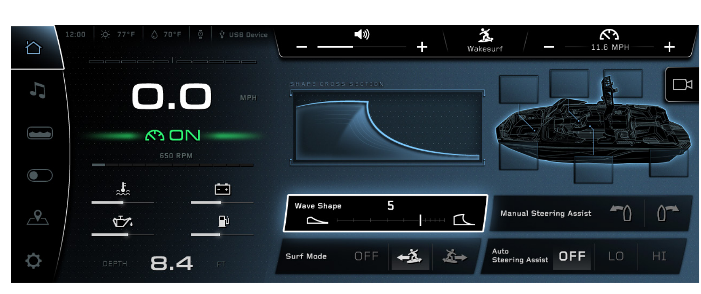
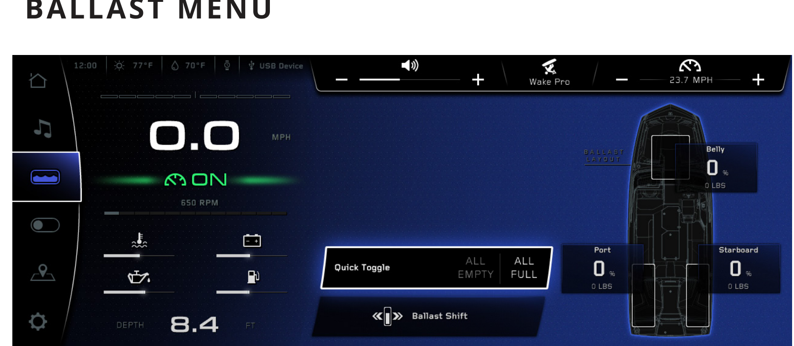
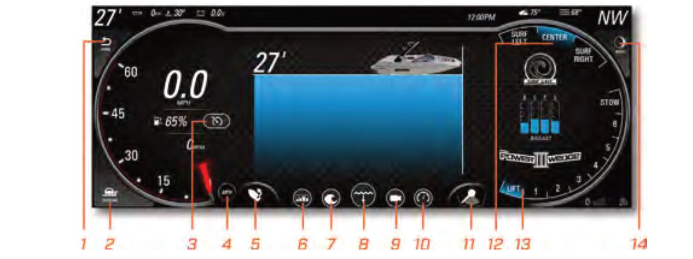
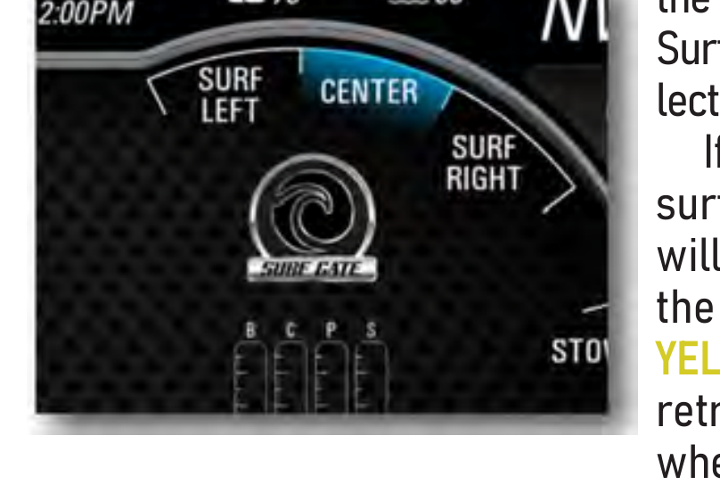
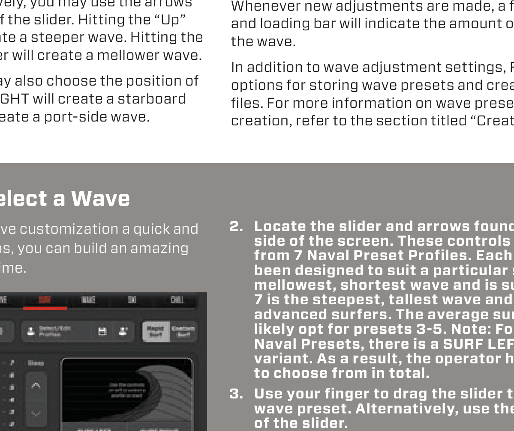
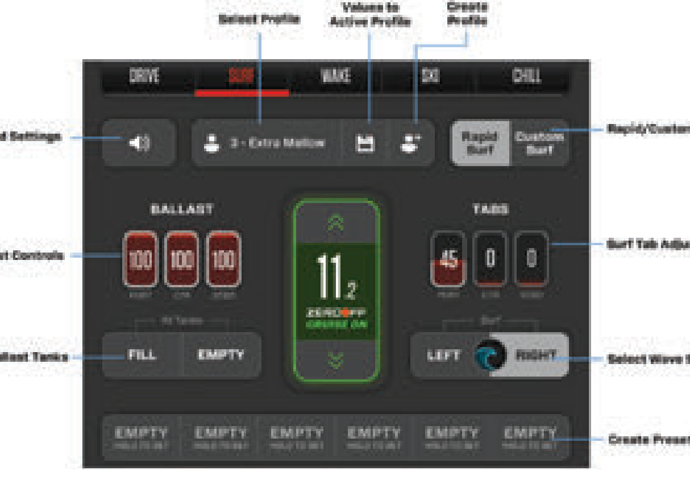
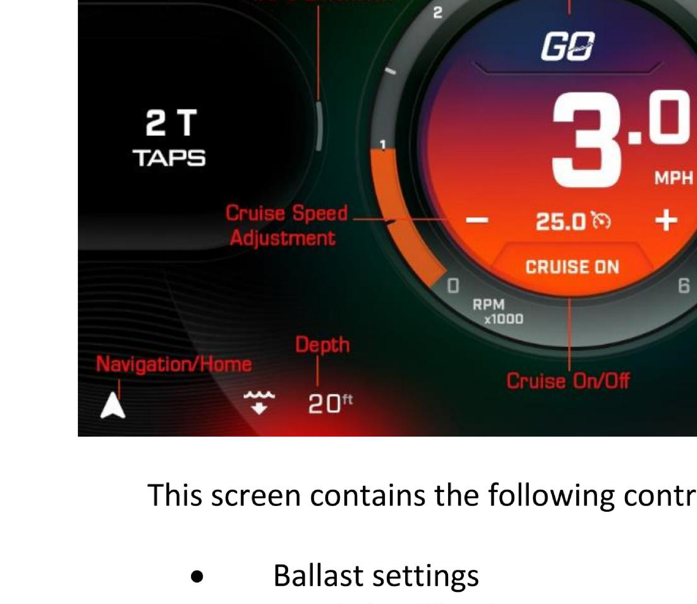
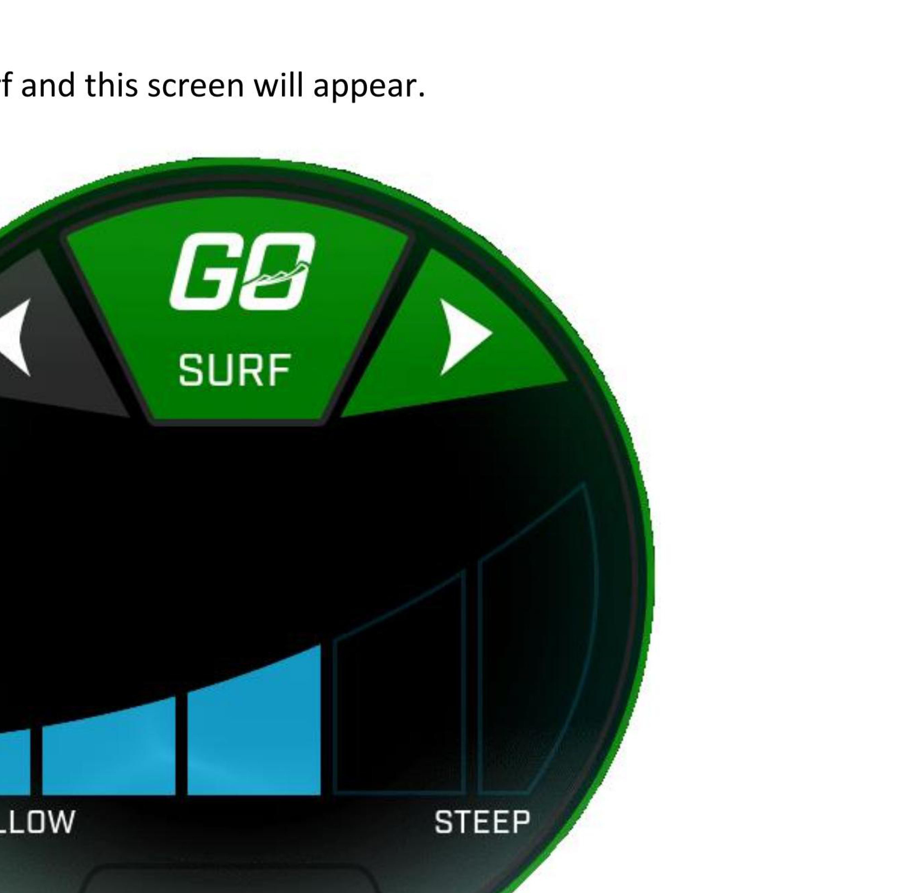
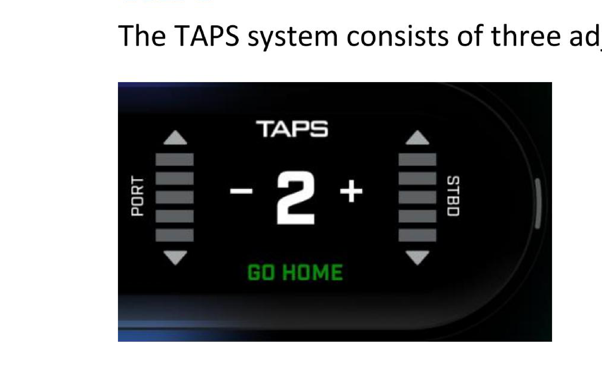
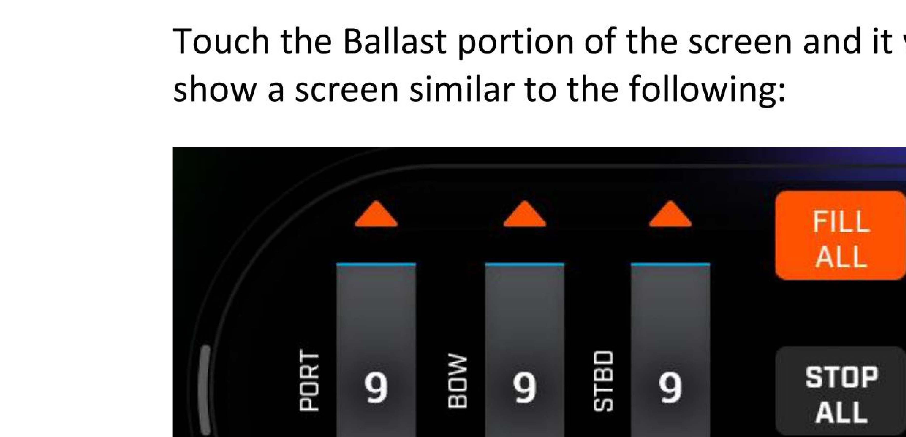

# Sistemas de surf de fábrica — Investigación de pantallas y UX

Material de referencia para el **proyecto de flaps Lenco**. Todo lo que sigue está
sacado de los manuales oficiales de cada fabricante (links al final), no de
suposiciones. Las capturas de `img/` son recortes de esos manuales y están acá
solamente como **referencia de diseño interna** — no redistribuir.

**Prototipo operable:** [`prototipo-hud.html`](prototipo-hud.html) reconstruye las cuatro
pantallas en HTML/CSS/JS puro (sin dependencias) más una propuesta de interfaz para los
flaps Lenco. Publicado también acá: https://claude.ai/code/artifact/1d5cb2b3-9911-4283-ba5a-345c0d3dc614

Índice:

1. [Resumen comparativo](#1-resumen-comparativo)
2. [Nautique — LINC Panoray + NSS](#2-nautique--linc-panoray--nss)
3. [Malibu — MaliView + Surf Gate](#3-malibu--maliview--surf-gate)
4. [MasterCraft — PV1100 / PV700 + Surf Star](#4-mastercraft--pv1100--pv700--surf-star)
5. [Tigé — CLEAR Horizon + TAPS 3](#5-tigé--clear-horizon--taps-3)
6. [Patrones de UX que se repiten en las 4 marcas](#6-patrones-de-ux-que-se-repiten-en-las-4-marcas)
7. [Qué copiar para el controlador de flaps Lenco](#7-qué-copiar-para-el-controlador-de-flaps-lenco)
8. [Modelo de datos sugerido](#8-modelo-de-datos-sugerido)
9. [Fuentes](#9-fuentes)

---

## 1. Resumen comparativo

| | **Nautique** | **Malibu** | **MasterCraft** | **Tigé** |
|---|---|---|---|---|
| Pantalla | LINC Panoray 12.4" (una o dos) | MaliView 12" central + 7" izquierda | PV1100 ~11" + PV700 7" (dual dash) | CLEAR Horizon 12.1" |
| Sistema de olas | NSS (Nautique Surf System) + NCRS Hydro-Plate | Surf Gate + Power Wedge III | Surf Star System (3 tabs inox) | TAPS 3 / 3T (3 platos) |
| Actuadores | Platos laterales actuados | Compuertas laterales (gates) | Electro-hidráulicos + PDM | Actuadores "military grade", 3 t de empuje |
| Cómo se elige el lado | 2 íconos de surfista (◀ / ▶) | Arco de 3 estados: SURF LEFT / CENTER / SURF RIGHT | Botones `SURF LEFT` / `SURF RIGHT` (rocker) | Flechas ◀ / ▶ sobre el dial |
| Cómo se ajusta la ola | `Wave Shape` **0–10** (slider + cross-section) | Indirecto: ballast + Power Wedge (7 posiciones) | `Rapid Surf`: 7 presets con slider; `Custom Surf`: % por tab | `TAPS`: platos PORT/STBD por barras + centro 1–5 |
| Metáfora visual | Corte transversal de la ola (curva) | Arco tipo velocímetro | Gráfico de ola + slider vertical | Dial circular con barras crecientes |
| Presets | User Profiles (velocidad + ballast + wave shape + lado) | Presets con wizard de 6 pasos | 7 Naval Presets + 30 perfiles custom + 6 slots rápidos | 4 perfiles GO: Ski / Surf / Wake / Go Home |
| Botón "todo listo" | Perfil de usuario | Home Mode / Load Preset | Tow Mode (Surf/Wake/Ski) | **GO** |
| Color de acento | Cian / verde (cruise ON) | Azul Malibu | Rojo MasterCraft | Verde + naranja Tigé |

---

## 2. Nautique — LINC Panoray + NSS



### Hardware

- Pantalla **LINC Panoray de 12.4"**, versión de una o dos pantallas según modelo.
- Se maneja con **touch** y además con el **Helm Command**: una perilla física con
  botones dedicados (Home, User, Speed Control, Volumen, Cámara). La perilla gira
  para incrementar/decrementar y se presiona para confirmar / togglear.
- Actuadores: **NSS** = platos actuados a cada lado de la popa. **NCRS** =
  Hydro-Plate central (trim/planeo + shaping de la estela).

### Layout exacto de la pantalla de surf

```
┌────┬──────────────────────────────────────────────────────────────────────┐
│ ⌂  │ 12:00 ☀77°F 💧70°F ⏱ ⚡USB │  🔊 − ▬▬▬ +  │ 🏄 Wakesurf │ ⏱ − 11.6 MPH + │
│ ♪  ├──────────────┬───────────────────────┬───────────────────────────┬───┤
│ ▭  │   0.0  MPH   │  SHAPE CROSS SECTION  │   [ vista cenital barco   │📷 │
│ ⬤  │   ⟳ ON       │   ╭──────────────╮    │     con tanques de        │   │
│ 📍 │   650 RPM    │   │  ~~~~╲       │    │     ballast alrededor ]   │   │
│ ⚙  │   ▬▬▬▬       │   ╰──────────────╯    │                           │   │
│    │ 🌡 ▬▬ 🔋 ▬▬  ├───────────────────────┴───────────────────────────┤   │
│    │ 🛢 ▬▬ ⛽ ▬▬  │ Wave Shape      5      │ Manual Steering Assist ↰ ↱│   │
│    │              │ ◟──┼┼┼┼┼┼┼┼┼┼──◝      │                           │   │
│    │ DEPTH 8.4 FT │ Surf Mode  OFF 🏄◀ 🏄▶ │ Auto Steering Assist OFF LO HI│
└────┴──────────────┴───────────────────────┴───────────────────────────────┘
```

Elementos, de izquierda a derecha:

- **Rail vertical izquierdo** (siempre visible, 6 íconos): Home, Media, Ballast,
  Switches, Mapa, Settings. El activo se marca con un bloque más claro y borde.
- **Barra superior**: hora, temp de aire, temp de agua, ícono de reloj/timer, USB.
  Después tres bloques separados por diagonales: volumen (− slider +),
  **perfil activo** con ícono ("Wakesurf" / "Wake Pro"), y **set speed** (− 11.6 MPH +).
- **Columna izquierda**: velocidad gigante (`0.0` + MPH chico), estado de cruise
  (`⟳ ON` en verde con un glow horizontal), RPM, barra de RPM, cuatro mini-gauges
  con íconos (temp agua, batería, aceite, combustible) y **DEPTH 8.4 FT** abajo.
- **Centro**: `SHAPE CROSS SECTION` — dibujo del **corte transversal de la ola**,
  que cambia de rampa suave a labio vertical según el valor de Wave Shape. Es el
  elemento característico de Nautique.
- **Derecha**: render cenital del barco con los **tanques de ballast** como
  rectángulos alrededor del casco (se ponen azules mientras cargan/descargan).
- **Fila inferior central**: `Wave Shape` con el número grande al medio y un
  **slider con ticks** entre dos íconos que representan el perfil de ola
  (rampa suave a la izquierda, labio steep a la derecha).
- **Fila inferior**: `Surf Mode` con tres estados — `OFF`, surfista con flecha a la
  izquierda (**Port**), surfista con flecha a la derecha (**Starboard**). El activo
  queda resaltado en blanco/claro.
- **Derecha inferior**: Manual Steering Assist (dos botones de barco girando) y
  Auto Steering Assist `OFF / LO / HI`.
- **Botón de cámara** flotante arriba a la derecha.

### Reglas de comportamiento (esto es lo importante)

- La pantalla **cambia según la velocidad seteada**:
  - **< 13.0 mph → modo surf**: aparecen `Wave Shape` (0–10) y `Surf Mode`.
  - **≥ 13.0 mph → modo wake**: aparecen `Wake Shape` (0–5) y `Plane Assist` (OFF/LO/HI).
- `Wave Shape` **0–10**: más alto = ola más parada. Del 6 al 10 el ajuste del labio
  es más fino (los pasos son más chicos). En wake solo hay 0–5.
- **Surf Mode no está disponible si el Speed Control está apagado** — porque el
  barco podría llegar a velocidad de planeo, que no sirve para surfear. En ese caso
  el widget se reemplaza por Plane Assist. Los indicadores de cruise apagado se
  dibujan en **naranja**.
- **Transferencia de lado en marcha**: se toca el ícono de surfista *no* resaltado y
  la ola se pasa al otro lado sobre la marcha, sin mover gente ni ballast.
- El `Wave Shape` es un valor **único** que la ECU traduce a cuánto sale cada plato
  del NSS y cómo se posiciona el Hydro-Plate. El usuario **no toca los platos por
  separado** — es la diferencia principal con MasterCraft y Tigé.

### Perfiles de usuario



- Botón `User` en el Helm Command → lista de perfiles → editar/crear.
- Un perfil guarda: **nombre, ícono, set speed, wave/wake shape y nivel individual
  de cada tanque de ballast**. Si la velocidad del perfil es de surf (< 13.0 mph),
  además aparece el campo **Surf Side**.
- Mientras se editan los valores en la lista de la izquierda, **el gráfico de la
  derecha se actualiza en vivo**. Botones `Cancel` / `Save Changes`.
- Teclado completo en el lado derecho para el nombre, se cierra con `Enter`.

### Menú de ballast

- Gráfico cenital del barco con cada tanque etiquetado (`Port`, `Starboard`, `Belly`)
  mostrando **% y libras**.
- `Quick Toggle`: `ALL EMPTY` / `ALL FULL`.
- `Ballast Shift`: mueve peso de babor a estribor en **incrementos de 50 lb (23 kg)**.
- Tocar un tanque abre un popup `Set Level` para fijarlo a un %.

### Control remoto

- **Nautique Surf Switch**: control de muñeca para el surfista — cambia el lado de
  la ola sin señas con la mano.
- App para **relojes Garmin**: velocidad, música, wave shape, ballast y lado.

---

## 3. Malibu — MaliView + Surf Gate



### Hardware

- **Dos táctiles**: MaliView de **12"** sobre el volante y una de **7"** a la
  izquierda del volante (estéreo, luces, mapas, calefactor, bilge, blower).
- Opcional: **Sport Dash**, un controlador rotativo físico a la derecha del volante
  que replica los controles de Surf Gate, Power Wedge, cruise y estéreo.
- Actuadores: **Surf Gate** (compuertas laterales) + **Power Wedge III**
  (hasta 1.500 lb de desplazamiento de agua).

### Layout de la pantalla de 12"

Es una pantalla apaisada, muy "instrumento analógico", con dos arcos grandes:

- **Arco izquierdo**: velocímetro / tacómetro (se intercambian con el botón
  Speed/Tach Swap). Adentro: velocidad grande `0.0 MPH`, % de combustible, botón de
  cruise. El arco tiene una aguja roja.
- **Centro**: la zona grande — depth screen (azul), cámara, mapa o presets según
  lo que se elija en la fila de botones de abajo.
- **Arco derecho**: acá vive todo el sistema de surf.
- **Fila inferior de 14 botones**: Home, Docking, Cruise, Speed/Tach swap, Stern
  turn, Ballast, Presets, Depth, Media, Gauges, Rudder position, Surf Gate,
  Power Wedge, Night mode.
- **Barra superior**: profundidad `27'`, presión, trim, voltaje, hora, temp de aire,
  temp de agua y **rumbo (`NW`)** grande en la esquina.

### El widget Surf Gate — el más imitable



Un **arco de tres segmentos** arriba a la derecha:

```
        ╭─────────────────────────╮
   SURF │        CENTER           │  SURF
   LEFT │      (azul = activo)    │  RIGHT
        ╰─────────────────────────╯
              ◎ SURF GATE
           B   C   P   S     ← barras de ballast
           ▮   ▮   ▮   ▮
        POWER ⅠⅠⅠ WEDGE
                            STOW 8 7 6 5 4 3 2 1 0  ← arco derecho
                       LIFT
```

- Los tres segmentos son **SURF LEFT / CENTER / SURF RIGHT**. Se toca uno y listo.
- Debajo: el **logo Surf Gate** (la espiral de ola), las **4 barras verticales de
  ballast** etiquetadas `B C P S` (Bow, Center, Port, Starboard), y el logo
  **POWER WEDGE III**.
- A la derecha, un **arco tipo escalera** con `STOW` arriba y posiciones **0 a 8**
  del Power Wedge, más `LIFT` abajo.

### Máquina de estados por color (copiar tal cual)

Esto es lo mejor documentado de las cuatro marcas y aplica idéntico a flaps Lenco:

| Estado | Color en el segmento seleccionado |
|---|---|
| Lado seleccionado, pero el barco todavía no llegó a velocidad de surf | **BLANCO** |
| Compuerta **en movimiento** (extendiendo o retrayendo) | **AMARILLO** |
| Compuerta **totalmente extendida** | **AZUL** |
| Compuerta **totalmente retraída** | **BLANCO** |

- Las compuertas **empiezan a extender entre 9.0 y 15.0 mph**.
- Si el barco sale de ese rango, se **retraen solas** (amarillo → blanco) y vuelven
  a salir cuando vuelve al rango. La selección del lado no se pierde.
- Al cambiar de lado, **las luces de la torre parpadean y suenan beeps** para avisar
  al surfista. Se puede desactivar en Settings.
- **Alarmas**: `Surf Gate High Speed` (arriba de 15 mph retrae hasta volver al rango),
  `Surf Gate Switch Left/Right Alarm` (el limit switch no cerró con la compuerta
  retraída). Ante error de switch, **ese lado queda bloqueado** (locked out).

### Power Wedge

- 7 posiciones seleccionables una vez desplegado. **Highlight azul = posición
  deseada**; una **barra azul sólida = posición real** mientras se mueve. Dos
  indicadores distintos: pedido vs. real.
- Para pasar de/hacia `Stow` el barco tiene que ir **entre 1.0 y 10.0 mph**
  (seguridad: que nadie esté cerca).
- Alarma arriba de **26 mph** si está desplegado.
- **Auto-Wedge**: queda en posición `Lift` hasta que el barco alcanza el **85% de la
  velocidad de cruise**, ahí va a la posición deseada; si cae más de **25%** vuelve a `Lift`.

### Presets (wizard de 6 pasos)

`Edit` → nombre (teclado) → `Next` → ícono → `Next` → **lado de surf** (para presets
de wake/ski se deja en Center) → `Next` → set point de cruise → `Next` → niveles de
ballast Bow/Center/Port/Starboard → guardar.

**Load**: se selecciona (queda **azul**), se toca `Load`, el highlight pasa a
**amarillo** mientras el sistema ejecuta, el botón Wake también se pone amarillo y
Cruise queda en `ON`. Después el sistema mueve ballast + cruise + wedge + gate solo.

**Cancel**: apagar el speed control. Ojo — **el wedge, el gate y el ballast quedan
donde están**, no vuelven solos.

**Home Mode**: un solo toque → apaga cruise, drena todos los tanques, centra el
Surf Gate y guarda el Power Wedge, siempre que el barco vaya **entre 1 y 10 mph**.

---

## 4. MasterCraft — PV1100 / PV700 + Surf Star



### Hardware

- **Dual Screen Dash**: **PV1100** (~11") + **PV700** (7"). Modelos más chicos solo
  llevan la PV700.
- Actuadores **electro-hidráulicos** comandados por **PDM** (Power Distribution
  Modules); tabs de acero inoxidable: **babor, centro y estribor**.
- También hay un **switch pack en el volante** (UP/DOWN para tabs, FILL/EMPTY para
  ballast) que funciona en paralelo a la pantalla.

### Estructura de navegación

Barra superior con 5 modos, siempre visible, el activo subrayado en **rojo**:

```
   DRIVE  |  SURF  |  WAKE  |  SKI  |  CHILL
             ▔▔▔▔ (rojo)
```

- **DRIVE** — crucero normal: AutoLaunch, velocidad, ballast, tabs, cruise.
- **SURF / WAKE / SKI** — los tres "Tow Mode".
- **CHILL** — para menos de 2 mph o parado; estéreo expandido.
- **No se puede cambiar de modo con la marcha puesta** (adelante o atrás).

### Surf Mode = Rapid Surf + Custom Surf

Segunda fila (siempre igual en los dos submodos):

`🔊 Sound Settings` · `👤 Select/Edit Profiles` · `💾 Save Current Values` ·
`👤+ Create Profile` · toggle **`Rapid Surf` / `Custom Surf`** (arriba a la derecha)

#### Rapid Surf

```
┌─────────────────────────────────────────────────────────┐
│  DRIVE   SURF   WAKE   SKI   CHILL                      │
├─────────────────────────────────────────────────────────┤
│ 🔊 │ 👤 3 - Extra Mellow │ 💾 │ 👤+ │  Rapid │ Custom    │
├─────────────────────────────────────────────────────────┤
│  ─7  Steep  ╭───────────────────────────────────────╮   │
│  ─6         │                                       │   │
│  ─5    ⌃    │        [ gráfico de la ola ]          │   │
│  ─4         │                                       │   │
│  ─3    ⌄    │                                       │   │
│  ─2         ├───────────────────┬───────────────────┤   │
│  ─1 Mellow  │   SURF LEFT       │   SURF RIGHT      │   │
│  ●          ╰───────────────────┴───────────────────╯   │
├─────────────────────────────────────────────────────────┤
│ EMPTY │ EMPTY │ EMPTY │ EMPTY │ EMPTY │ EMPTY           │
│ HOLD TO SET                                             │
└─────────────────────────────────────────────────────────┘
```

- **Slider vertical** a la izquierda con 7 posiciones marcadas (1 abajo = *Mellow*,
  7 arriba = *Steep*), con un thumb circular gris. Al lado, **flechas ⌃ / ⌄**
  para ir de a uno.
- Los 7 son los **"Naval Preset Profiles"**: 1 = ola más chica y corta
  (principiantes), 7 = la más alta y parada, **3–5 es lo normal**. Como cada uno
  tiene variante izquierda y derecha, **son 14 presets en total**.
- **Gráfico de la ola** grande a la derecha; el agua se pinta en **cian** y la ola
  se re-dibuja con cada cambio.
- **Readiness timer**: cuando se cambia algo aparece una **luz amarilla parpadeando
  y una barra de progreso** con el tiempo que falta para que la ola se forme.
  *(Detalle muy bueno para copiar: el usuario sabe que el sistema está trabajando.)*
- Abajo: **6 slots de preset rápido** que dicen `EMPTY / HOLD TO SET` — se guarda
  con **mantener presionado** un slot vacío.

#### Custom Surf



Acá se ve todo por separado, en tres columnas:

- **Izquierda — `BALLAST`**: tres cápsulas rojas con el % de llenado
  (`100` `100` `100`), etiquetadas Port / Ctr / Stbd, y debajo `FILL` / `EMPTY`
  ("All Tanks"). Tocar una cápsula abre la pantalla dedicada de ese tanque.
- **Centro — `ZEROOFF`**: cápsula vertical con borde **verde** cuando está activo,
  chevrons `⌃` y `⌄` arriba y abajo, la velocidad grande con el decimal más chico
  (`11.2`) y `ZEROOFF CRUISE ON` en verde abajo.
- **Derecha — `TABS`**: tres cápsulas con la **posición porcentual de cada tab**
  (`45` `0` `0`), etiquetadas Port / Ctr / Stbd; la que está actuando se pinta de
  **rojo** por debajo. Debajo, un **rocker `LEFT` ⬤ `RIGHT`** con el logo de la ola
  como perilla — el lado activo queda con fondo claro.
- Abajo, los mismos **6 slots** `EMPTY / HOLD TO SET`.

> Esta es la pantalla más parecida a lo que necesita un controlador de flaps Lenco:
> **valor numérico por flap + selector de lado + cruise + ballast, todo en una vista.**

### Perfiles

- `Create Profile` → misma grilla (ballast + tabs + velocidad + lado) → `NEXT` →
  teclado para el nombre → **`SAVE & ACTIVATE`** o **`SAVE & CLOSE`**.
- **Profile Manager**: hasta **30 perfiles**, dropdown a la derecha, botones de
  editar y borrar, `ACTIVATE` / `DEACTIVATE`.
- También hay **perfiles de foil** (`FOIL LEFT` / `FOIL RIGHT`, niveles Beginner e
  Intermediate) dentro del modo surf.
- Wake Mode: 3 perfiles de fábrica (Beginner / Intermediate / Advanced); el activo
  se pone gris claro.

### Detalle técnico del Surf Star

- **Más plato metido en el agua de un lado = ola más suave (mellow); menos plato =
  ola más parada (steep).** Es contra-intuitivo, conviene tenerlo presente al mapear
  el valor del slider al recorrido del flap.
- **AutoLaunch**: `Single` usa solo el tab central para plantar el barco; `Triple`
  usa los tres.
- Los actuadores electro-hidráulicos responden al instante — el manual recomienda
  **toques momentáneos cortos** del switch, y advierte que un movimiento grande de
  golpe puede hacer perder el control del barco.

---

## 5. Tigé — CLEAR Horizon + TAPS 3



### Hardware

- **CLEAR Horizon**: táctil de **12.1"**, contraste 1000:1, antirreflejo, carcasa
  estanca, perfil ultra bajo al lado del volante.
- **TAPS 3 / 3T**: **tres platos** independientes (babor, centro, estribor).
  El 3T usa actuadores que aguantan más de 3 toneladas.
- Filosofía declarada: **todo en uno o dos toques**, sin menús anidados, con
  **gestos de swipe** para traer un segundo panel sin cambiar de pantalla.

### Home screen

Es un **instrumento circular** al centro, radicalmente distinto a las otras tres:

- Aro exterior: **tacómetro 0–6 x1000 RPM** con arco naranja.
- Adentro: fondo con degradé **naranja/rojo/violeta**, logo `GO` arriba,
  **velocidad gigante `3.0 MPH`**, debajo `− 25.0 ⏱ +` (cruise set) y
  **`CRUISE ON`** en una pestaña.
- **Izquierda**: bloque `2 T` / `TAPS` (nivel de TAPS actual).
- **Derecha**: bloque `ⅠⅠⅠ` / `BALLAST`.
- **Barra superior**: lights & settings, hora, boat health / rudder position,
  mute, volumen, audio.
- **Barra inferior**: Navigation/Home (flecha), Depth (`20 ft`), Cruise On/Off,
  Fuel, Video.

### El sistema GO

Se toca el botón central `GO` y se abre una **rueda de 4 cuartos**:

```
            SURF
      SKI  ╱  GO  ╲  WAKE
            OFF
          GO HOME
```

Al elegir uno, se entra a la pantalla de ese perfil.

#### GO SURF



- Dial circular con borde **verde**.
- Arriba, tres segmentos angulados: **flecha ◀** (izquierda), **`GO` / `SURF`**
  (centro, verde), **flecha ▶** (derecha). El **lado activo se pinta verde**, el
  inactivo gris oscuro. En la captura del manual: babor gris, estribor verde.
- Adentro, un **histograma de 5 barras crecientes** que dibujan la silueta de la
  ola: las llenas en **cian**, las vacías solo contorneadas.
- Etiquetas **`MELLOW`** (izquierda) y **`STEEP`** (derecha) abajo.
- **Se toca directo el tramo de la ola** que se quiere — no hay slider ni +/−.
- **Cada lado guarda su propio ajuste de ola.**
- Detalle documentado: **la velocidad sube 0.1 mph al bajar el nivel de ola y baja
  0.1 mph al subirlo** — el sistema compensa solo.
- Botón `•••` abajo → `CUSTOMIZE SURF`.

#### CUSTOMIZE SURF

Panel de settings con tabs (`Ski` / `Surf` / `Wake` / `Home`) y sub-tabs
`Default Left` / `Default Right` / `Foil Left` / `Foil Right`. Filas con `− valor +`:

| Campo | Ejemplo |
|---|---|
| Default Surf Level | 3 |
| Cruise | 11.8 |
| TAPS | 3 |
| Port Ballast | 50 |
| Stbd Ballast | 50 |
| Bow Ballast | 50 |

Botones `SAVE` y `RESET`. Menú lateral izquierdo: Display, Bluetooth, GO System,
Ballast, Faults, GPS, Steering.

#### GO WAKE / GO SKI

Mismo dial, pero con tres botones **`BEG` / `INT` / `ADV`** (el activo en verde) y
la leyenda **`AUTO TAPS ACTIVE  2 T`** — es decir, TAPS se ajusta solo según el
nivel elegido, y a medida que sube la velocidad se habilita el ajuste manual.

#### GO HOME

Vuelve al instrumento circular con la velocidad, enciende Zero Off y **TAPS vuelve
por default a 2**.

### El widget TAPS



```
            TAPS
   ▲                    ▲
  ▤▤▤                  ▤▤▤
P ▤▤▤    −  2  +       ▤▤▤ S
O ▤▤▤                  ▤▤▤ T
R ▤▤▤                  ▤▤▤ B
T ▤▤▤                  ▤▤▤ D
   ▼                    ▼
          GO HOME
```

- **Dos columnas de 5 segmentos**, `PORT` a la izquierda y `STBD` a la derecha,
  cada una con **flecha ▲ arriba y ▼ abajo** — ajustan **el plato de ese lado**.
- Al medio, **`− 2 +`** ajusta el **plato central**, niveles **1 a 5**.
- Abajo, el perfil activo en verde (`GO HOME`).
- Es el control de flaps más "crudo" de las cuatro marcas: **cada plato por
  separado, con feedback de barras**. Para un sistema Lenco de 2 o 3 flaps es el
  modelo más directo de copiar.

### Ballast



Tres columnas verticales `PORT` / `BOW` / `STBD` con el nivel **0–9**, flecha
naranja arriba y abajo de cada una, y a la derecha tres botones apilados:
**`FILL ALL`** (naranja), **`STOP ALL`**, **`DRAIN ALL`**. Se retrae tocando el
borde izquierdo del panel.

Al llenar ballast o cambiar de perfil aparece un **warning obligatorio** con `OK`
sobre exceder la capacidad de la Coast Guard.

---

## 6. Patrones de UX que se repiten en las 4 marcas

1. **Un solo control primario para la forma de la ola.** Nautique: 0–10.
   MasterCraft: 1–7. Tigé: 5 tramos. Malibu lo esconde detrás de presets.
   Nadie obliga al conductor a pensar en grados de flap.
2. **Selector de lado siempre visible y siempre binario/ternario.** Izquierda,
   (centro), derecha. Nunca un dropdown.
3. **Feedback visual del *resultado*, no del actuador.** Las cuatro dibujan la
   **ola**, no el flap. El actuador aparece como dato secundario.
4. **Distinción explícita entre posición pedida y posición real.** Malibu la hace
   con colores (blanco → amarillo → azul), MasterCraft con un timer de readiness,
   Malibu también con la barra sólida del Wedge. **Nunca se muestra el valor pedido
   como si ya estuviera aplicado.**
5. **Gates por velocidad.** Nautique bloquea surf sin cruise; Malibu extiende entre
   9 y 15 mph y retrae fuera de rango; Malibu mueve el Wedge solo entre 1 y 10 mph;
   MasterCraft no deja cambiar de modo con marcha puesta.
6. **Presets con nombre + ícono, y un botón de "todo listo".** GO en Tigé,
   Load Preset en Malibu, Tow Mode en MasterCraft, User Profile en Nautique.
7. **Un botón de "volver a la normalidad"**: Home Mode (Malibu) y GO HOME (Tigé)
   centran los flaps, drenan ballast y apagan el cruise de una.
8. **Redundancia física**: perilla (Nautique Helm Command, Malibu Sport Dash),
   switch pack (MasterCraft), remoto de muñeca (Nautique Surf Switch). La pantalla
   nunca es el único camino.
9. **Alertas hacia afuera del barco**: Malibu hace parpadear las luces de la torre
   y suena beeps al cambiar de lado, para avisarle al surfista.

---

## 7. Qué copiar para el controlador de flaps Lenco

Los actuadores Lenco son **CAN / NMEA 2000**, con motores de alto torque (empujan
~500 lb) y conectores Deutsch. Eso permite leer **posición real** del flap, no solo
comandarla — así que se puede implementar el patrón "pedido vs. real" en serio.

### Recomendación: base MasterCraft *Custom Surf* + estados de color de Malibu

Es la combinación más honesta con un sistema de flaps: MasterCraft muestra el valor
numérico por flap (que es lo que un instalador de Lenco necesita ver y calibrar), y
Malibu tiene la mejor máquina de estados para el movimiento del actuador.

**Pantalla principal propuesta:**

```
┌───────────────────────────────────────────────────────────────┐
│  NAVEGAR   │   SURF   │   WAKE   │   CONFIG                   │  ← modos
├───────────────────────────────────────────────────────────────┤
│ 🔊 │  Perfil: "Nico - Mellow"  │ 💾 │ 👤+ │  Rápido │ Manual   │
├──────────────┬──────────────────────────┬─────────────────────┤
│  FLAPS       │      [ ola dibujada ]    │   VELOCIDAD         │
│              │                          │                     │
│  BABOR       │   ╭────────────────╮     │      ⌃              │
│   ┌────┐     │   │      ~~~╲      │     │    11.2             │
│   │ 45 │ ▲▼  │   │         ╲__    │     │   CRUISE ON         │
│   └────┘     │   ╰────────────────╯     │      ⌄              │
│  ESTRIBOR    │                          │                     │
│   ┌────┐     ├──────────────┬───────────┤   BALLAST           │
│   │  0 │ ▲▼  │  ◀ BABOR     │ ESTRIBOR ▶│   ┌──┐ ┌──┐ ┌──┐    │
│   └────┘     │              │           │   │50│ │50│ │50│    │
│              │  ●━━━━━━━━━━━━━━━━━━━━●  │   └──┘ └──┘ └──┘    │
├──────────────┴──────────────┴───────────┴─────────────────────┤
│  P1 │ P2 │ P3 │ P4 │ P5 │ P6      (mantener para guardar)     │
└───────────────────────────────────────────────────────────────┘
```

**Checklist de lo que hay que implementar sí o sí:**

- [ ] **Un slider maestro 0–10** (como Nautique) que traduzca a % de cada flap por
      una curva de calibración. El modo manual por flap queda detrás de un toggle
      `Rápido / Manual` (como MasterCraft).
- [ ] **Selector de lado de 3 estados**: `BABOR · CENTRO · ESTRIBOR`, con el arco de
      Malibu o el rocker de MasterCraft. Tocar el lado inactivo = transferencia.
- [ ] **Máquina de estados de color por flap**, copiada de Malibu:
      | Estado | Color |
      |---|---|
      | Pedido, esperando condiciones | blanco / gris |
      | En movimiento | **ámbar** (+ animación) |
      | En posición | **azul / cian** |
      | Retraído | blanco |
      | Falla de sensor / limit switch | **rojo** + lado bloqueado |
- [ ] **Posición pedida vs. posición real**: el número grande es la pedida, una
      barra fina debajo es la real leída por CAN. Nunca mostrar una sola.
- [ ] **Gates por velocidad configurables**: rango de extensión (default 9–15 mph),
      retracción automática fuera de rango sin perder la selección de lado,
      y bloqueo de cambio de modo con marcha puesta.
- [ ] **Readiness timer** al estilo MasterCraft: barra de progreso + indicador ámbar
      con el tiempo estimado hasta que la ola se forme.
- [ ] **Presets**: nombre + ícono + lado + nivel de ola + % por flap + velocidad +
      ballast. 6 slots rápidos con *hold to set* y un manager con más.
- [ ] **Botón "IR A CASA"**: centra flaps, apaga cruise, drena ballast — solo
      habilitado en el rango de velocidad seguro.
- [ ] **Dibujo de la ola** que reaccione al valor. Es lo que hace que la pantalla se
      lea como un sistema de surf y no como un panel de trim tabs.
- [ ] **Aviso al surfista** al cambiar de lado (luces / bocina), desactivable.
- [ ] Recordar que en Lenco/MasterCraft **más flap abajo = ola más suave**: definir
      la dirección del mapeo una vez y documentarla.

### Qué NO copiar

- El instrumento circular de Tigé es lindo pero desperdicia mucho espacio para
  mostrar pocos valores; en una pantalla chica se complica.
- Los arcos analógicos de Malibu son difíciles de leer con sol y caros de dibujar.
- El rail de 6 íconos de Nautique solo se justifica si el sistema maneja también
  música, mapas y luces.

---

## 8. Modelo de datos sugerido

```js
// Estado del sistema de surf
{
  modo: 'navegar' | 'surf' | 'wake' | 'config',
  lado: 'babor' | 'centro' | 'estribor',
  nivelOla: 0,              // 0-10, control maestro
  manual: false,            // true = editar cada flap por separado

  flaps: {
    babor:     { pedido: 45, real: 43, estado: 'moviendo' },
    centro:    { pedido: 0,  real: 0,  estado: 'retraido' },
    estribor:  { pedido: 0,  real: 0,  estado: 'retraido' },
  },

  velocidad: { actual: 11.1, set: 11.2, cruiseOn: true },

  ballast: {
    proa:      { pedido: 50, real: 48, bombeando: 'llenando' },
    babor:     { pedido: 50, real: 50, bombeando: null },
    estribor:  { pedido: 50, real: 50, bombeando: null },
  },

  gates: { minMph: 9.0, maxMph: 15.0, dentroDeRango: true },
  readiness: { activo: true, segundosRestantes: 6 },
  fallas: [],               // ej: [{ codigo:'LIMIT_SW_BABOR', lado:'babor' }]
}

// Preset
{
  id: 'p1',
  nombre: 'Nico - Mellow',
  icono: 'surfista',
  lado: 'babor',
  nivelOla: 3,
  flaps: { babor: 45, centro: 0, estribor: 0 },
  velocidad: 11.2,
  ballast: { proa: 50, babor: 100, estribor: 30 },
}
```

**Estados válidos de un flap** (transiciones):

```
retraido ──(pedido + en rango)──> moviendo ──> extendido
extendido ──(fuera de rango | centro)──> moviendo ──> retraido
cualquiera ──(sensor/limit fail)──> falla  [lado bloqueado]
```

---

## 9. Fuentes

Manuales oficiales (usados para las capturas y los datos numéricos):

- Nautique — *LINC Panoray Single Display, Super Air Nautique, 2022*:
  https://nautique.blob.core.windows.net/boat-manuals/2022/LINC-Single-Display-SAN-Manual-2022.pdf
- Nautique — *LINC Panoray, todos los Super Air, 2021*:
  https://nautique.blob.core.windows.net/boat-manuals/2021/2021-LINC-All-Super-Air-Models.pdf
- Malibu — *2023 Malibu Owners Manual* (Dashes and Video Screens, pág. 53-57):
  https://cdn.malibuboats.com/docs/owner-manuals/2023%20Malibu%20Owners%20Manual%20for%20Online.pdf
- MasterCraft — *2024 Owner's Manual* (PV1100 pág. 120-131, PV700 pág. 173-190,
  Surf Star pág. 327-329):
  https://www.mastercraft.com/media/3lzk2xyl/2024-mastercraft-owners-manual.pdf
- Tigé — *CLEAR Horizon 2025 Owner's Manual*:
  https://issuu.com/tigeboats/docs/2025-tigeclearhorizonmanual
- Tigé — índice de manuales: https://www.tige.com/more/owners-manuals

Páginas de producto:

- Nautique LINC Panoray tutorials: https://nautique.com/article/linc-panoray-touchscreen-tutorials
- Nautique Surf System: https://nautique.com/models/nautique-surf-system
- Malibu Truth in Command Center: https://www.malibuboats.com/discover-malibu/why-malibu/only-malibu/truth-in-command-center
- Malibu Truth in Surf Gate: https://www.malibuboats.com/discover-malibu/why-malibu/only-malibu/the-truth-in-surf-gate
- MasterCraft Gen 2 Surf System: https://actionwater.com/how-to-use-mastercraft-gen-2/
- Tigé CLEAR Horizon: https://tige.com/features/touch-2
- Tigé TAPS 3T: https://www.tige.com/features/taps-3t/
- Tigé GO System: https://www.tige.com/features/go/

Lenco:

- Actuadores (SD PRO, 100 Series): https://lencomarine.navico.com/trim/actuators/
- Controles y switches: https://lencomarine.navico.com/controls-and-switches/
